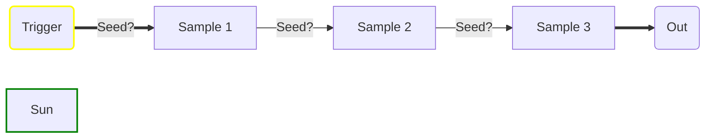
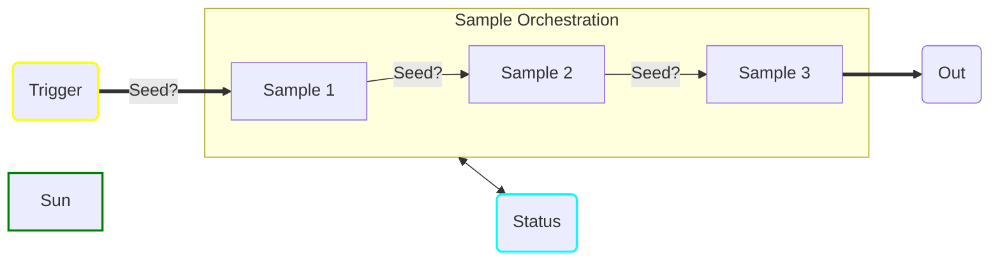

# Description
Sample project to demonstrate the workflow of a durable function and how to use it.

The delays in these functions are just to emulate a process that would take time.

# **Methods**

## Expected Workflow



## Endpoints

- **${\color{orange}1}$**  **sample1** (POST)
  - **parameters**:
    - **${\color{cyan}string}$** **OperationID** : ID used to group the logs, if you have the configurations
    - **${\color{cyan}int}$** **Seed** : Used to set the randomizer that will dictate the **delay** for this demo.
  - **returns**: **${\color{cyan}int}$** with the delay time executed
  
- **${\color{orange}2}$**  **sample2** (POST)
  - **parameters**:
    - **${\color{cyan}string}$** **OperationID** : ID used to group the logs, if you have the configurations
    - **${\color{cyan}int}$** **Seed** : Used to set the randomizer that will dictate the **delay** for this demo.
  - **returns**: **${\color{cyan}int}$** with the delay time executed
  
- **${\color{orange}3}$**  **sample3** (POST)
  - **parameters**:
    - **${\color{cyan}string}$** **OperationID** : ID used to group the logs, if you have the configurations
    - **${\color{cyan}int}$** **Seed** : Used to set the randomizer that will dictate the **delay** for this demo.
  - **returns**: **${\color{cyan}int}$** with the delay time executed

# **Durable Functions**

## Expected Workflow



## Endpoints
  
- **${\color{orange}1}$**  **process-sample-stage** (GET/POST)
  - **parameters**:
    - **${\color{cyan}string}$** **OperationID** : ID used to group the logs, if you have the configurations
    - **${\color{cyan}int}$** **Seed** : Used to set the randomizer that will dictate the **delay** for this demo.
  - **returns**: **${\color{cyan}string}$** message with the sample workflow information
  
## Status

- **${\color{orange}??}$**  **status/{instanceId}** (GET)
  - **parameters**:
    - **${\color{cyan}string}$** **instanceId** ${\color{orange}(required)}$ : Instance Id of the durable execution
    - **${\color{cyan}string}$** **subscription-key** ${\color{orange}(required for azure)}$ : Subscription key used when calling the functions
    - **returns**: **${\color{cyan}???}$** message containing the result of the execution
    - **Error**: ${\color{red}{Orchestration}}$ ${\color{red}{failed.}}$
    - **Finished**:
```json
{
    "name": "Sample_Orchestrator",
    "instanceId": "8295b0ef53f646ac8787ab017f812c55",
    "createdTime": "2023-02-25T15:05:22.1390286Z",
    "lastUpdatedTime": "2023-02-25T15:05:38.0509568Z",
    "input": {
        "OperationID": "b458843d-a1ce-4758-afad-c988edea34cc",
        "Seed": null
    },
    "output": "Total Delay time: 14491 ms",
    "runtimeStatus": 1,
    "customStatus": [
        {
            "Step": "Sample 1",
            "Message": "Seed: 6389 | Delay time: 5514 ms",
            "Status": "Finished"
        },
        {
            "Step": "Sample 2",
            "Message": "Seed: 4827 | Delay time: 2982 ms",
            "Status": "Finished"
        },
        {
            "Step": "Sample 3",
            "Message": "Seed: 7816 | Delay time: 5995 ms",
            "Status": "Finished"
        }
    ],
    "history": null
}
```

# **Configuration**
**${\color{red} {!!}}$** No configurations required to run locally
<br>
| **Name** | **Description** |
|--|--|
|**FUNCTIONS_EXTENSION_VERSION**| Runtime version|
|**FUNCTIONS_WORKER_RUNTIME**| The language worker runtime to load in the function app|
|**ApplicationName**| Name that will appears in the logs|
|**APPINSIGHTS_INSTRUMENTATIONKEY**| The instrumentation key for Application Insights|
|**APPLICATIONINSIGHTS_CONNECTION_STRING**| Application Insights connection, used by the logs|
|**StatusURL**| Url with 4 **string format** places, <span style="color:cyan">protocol</span>, <span style="color:cyan">host</span>, <span style="color:cyan">instanceID</span> and <span style="color:cyan">subscription key</span> <br/> `{0}://{1}/api/status/{2}?subscription-key={3}` |
|**LogLevel**| Minimum Log Level to be generated, from [**RauchTech.Logging**](https://github.com/eduardorauchbach/Rauchtech.Logging))|
|**WEBSITE_ENABLE_SYNC_UPDATE_SITE**| Definition for synchronous deployment|
<br/>
